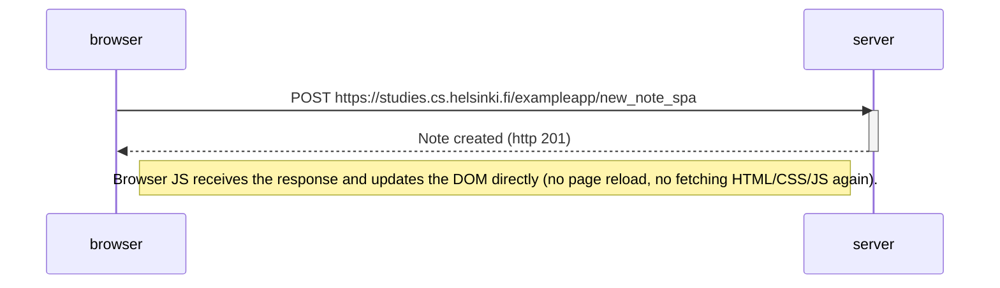

```mermaid 
    sequenceDiagram
        participant browser
        participant server

        browser->>server: POST https://studies.cs.helsinki.fi/exampleapp/new_note_spa
        activate server
        server-->>browser: Note created (http 201)
        deactivate server

        Note right of browser: Browser JS receives the response and updates the DOM directly (no page reload, no fetching HTML/CSS/JS again).
```